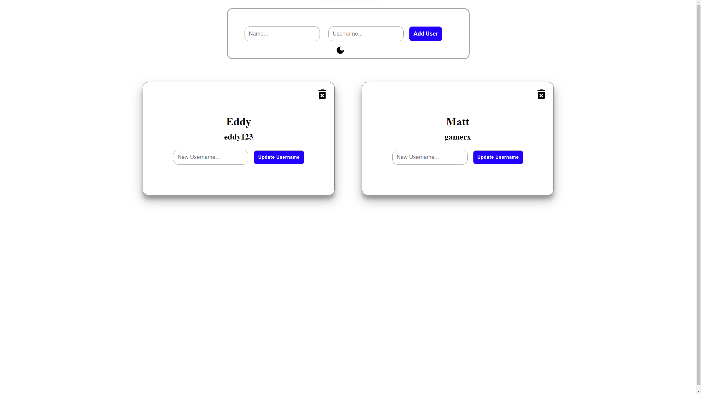
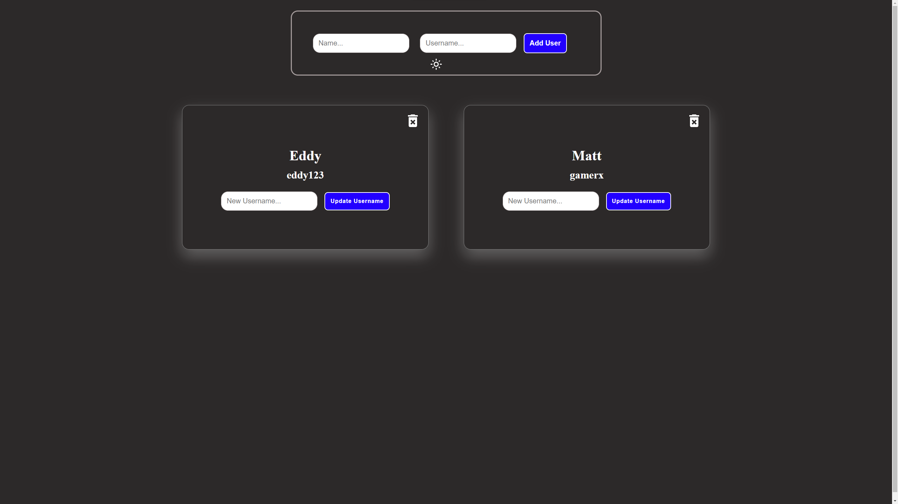

# Project Title

Name and Username

## Demo link:

<!-- Access my site at [google.com](https://google.com) -->

## About The App

[name and username] is a mobile responsive app that allows you enter a name and a username and add it to the list. the user can also update the username and delete the username with dark mode toggle. 

## Technologies

  &nbsp;
  &nbsp;
  &nbsp;
  &nbsp;
    &nbsp;

## Approach

Built with React and styled with CSS. the information is stored in redux for state and persist with redux persist storage. 

